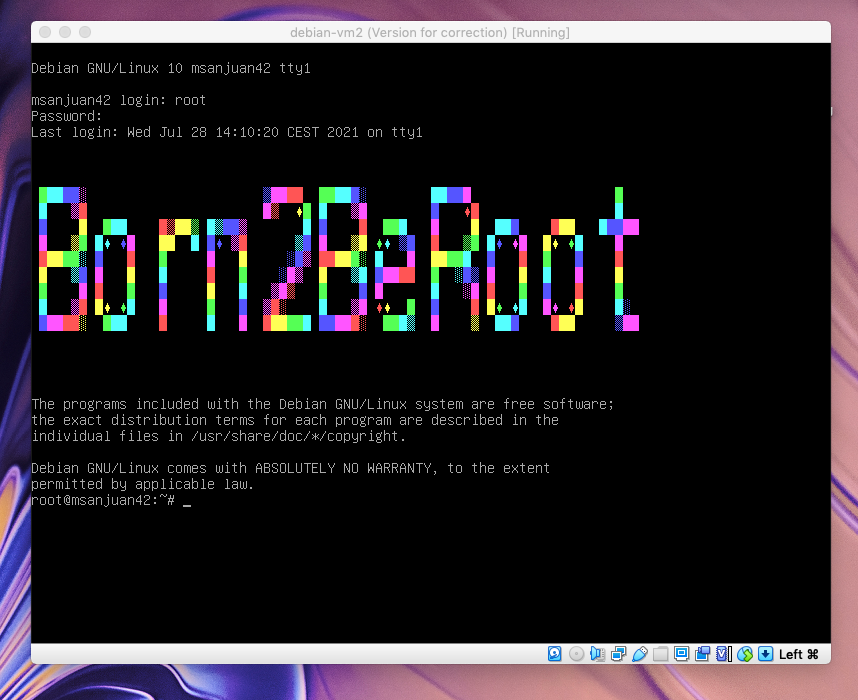
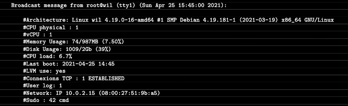

# :computer: 42_Born2beRoot

 
<h3>:loudspeaker: About</h3>

You will create your first machine by following specific instructions and using VirtualBox . Thus, after this project, you will be able to install your own operating system according to strict rules. 

Among these precise rules, we had to set up a small script named monitoring.sh (developed in bash).
It should look like this:

# Final note

